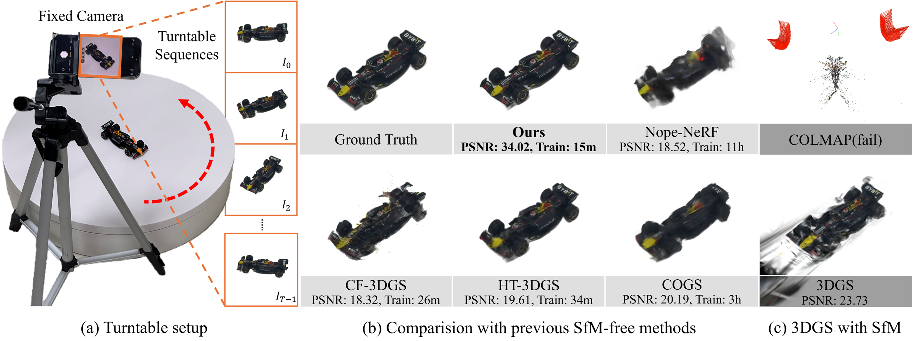
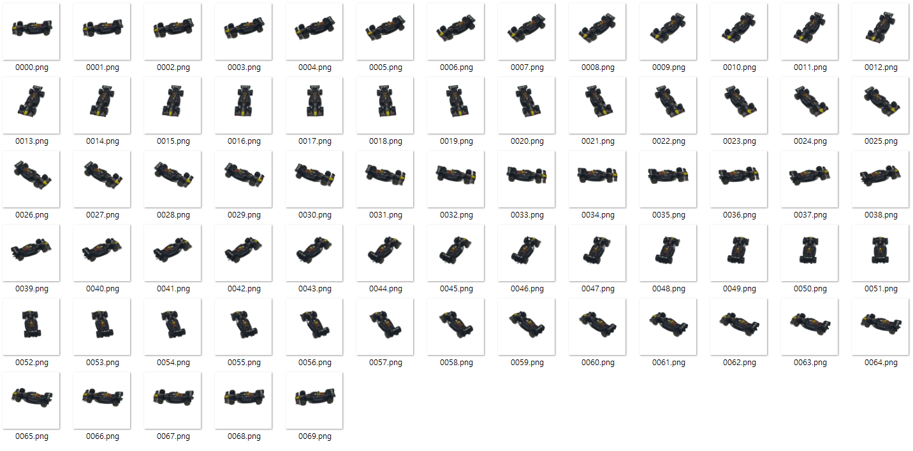

# RotGS: Rotation-Guided 3D Gaussian Splatting for Turntable Sequences without Structure-from-Motion
### Eurographics 2026
Kyumin Kim, Dohae Lee, Hanul Baek, In-Kwon Lee<br>
[Full Paper](assets/paper.pdf) | [Video](TBD) | [Dataset](https://drive.google.com/file/d/1Se70uQNnbQepflJ_xLdJXhajc3a11CuK/view?usp=sharing)<br><br>


Abstract: *The field of 3D reconstruction from multi-view images has advanced rapidly thanks to 3D Gaussian Splatting (3DGS), which enables efficient and photorealistic scene representation. However, optimizing 3DGS requires high-quality images from various viewpoints with accurate camera poses. The repeated collection of such data demands significant human effort, which poses a major constraint in practical applications. To address this issue, automated capturing systems that uses a turntable and fixed camera are widely employed. In a turntable setup, the background remains stationary while the object rotates. Therefore, pre- processing to remove the backgrond is essential, but the preprocessing reduces the number of reliable feature matches, which destabilizes Structure-from-Motion (SfM). This results in inaccurate camera poses, which degrades the quality of 3DGS recon- struction. We propose a novel method to optimize 3DGS in a turntable setup without SfM by leveraging the prior knowledge that objects rotate around a central axis. Unlike previous SfM-free methods that estimate camera poses for each frame, our approach reduces the complexity of optimization by representing rotations with a single global rotation axis. The estimated rotation is directly applied to the 3D Gaussians, producing motion defined as rotation flow. This rotation flow is then aligned with opti- cal flow to provide strong geometric supervision. Through uncertainty-to-detail flow scheduling, our approach remains stable during the initial training stage when the geometry of the Gaussian set is still inaccurate. On the NeRF-Synthetic dataset and on real-world datasets captured with a turntable, our method outperforms existing SfM-free approaches in both reconstruction quality and training speed, and even demonstrates performance comparable to 3DGS optimized with precise camera pose*


## Installation
```shell
git clone https://github.com/kyuminKim00/RotGS.git --recursive
cd RotGS
conda env create -f environment.yml 
conda activate rotgs
```
The code and environment is based on [3D Gaussian Splatting](https://github.com/graphdeco-inria/gaussian-splatting)


## Training
To train our model.

```shell
# single camera system
python train.py -s <path to dataset> --name <output_name>
# multi camera system
python train_multi.py -s <path to dataset> --name <output_name>
```

<details>
<summary><span style="font-weight: bold;">Command Line Arguments for train.py</span></summary>

  #### --wo_tiny
  residual refinement albation experiment
  #### --wo_flow
  flow loss albation experiment
  #### --wo_UDFS
  UDFS albation experiment
  #### --wo_axis
  axis optimizaiton albation experiment
  #### --sfm
  use sparse point cloud(from COLMAP) to Gaussian points initialization  

  other Command Line Arguments is same as [3DGS](https://github.com/graphdeco-inria/gaussian-splatting)
</details>

## Rendering
Using trained GS model, render test image.
```shell
python render.py -name <output_name>
python render.py -name <output_name> --multi_camera # multi camera systems
```

## Evaluation
```shell
python metrics.py -name <output_name>
```

## Processing your own Scenes
Our dataset loaders expect the following datset structure:
```
<location>
|---images
|   |---<image 0> # background removed images
|   |---<image 1>
|   |---...
|---sparse
    |---0
        |---cameras.txt # We only need camera intrinsic parameter
```

## Turntable Dataset

We also provide turntable dataset.<br>
Our dataset file structure:
```
# if data dir name drum_25 : 
        Data -> nerf_synthetic drum, Fixed camera -> spherical coords, theta = 25°, facing the scene center
<location>
|---images
|   |---<image 0> # background removed images
|   |---<image 1>
|   |---...
|---images_orig
|   |---<image 0> # original images
|   |---<image 1>
|   |---...
|---sparse
    |---0
        |---cameras.txt # We only need camera intrinsic parameter
|---sparse_colmap
    |---0
        |---cameras.txt # COLMAP result for experiments(we don't need this for our implementation)
        |---images.txt # COLMAP result for experiments(we don't need this for our implementation)
        |---points3D.txt # COLMAP result for experiments(we don't need this for our implementation)
        |---colmap.png # COLMAP result visualization
```

<section class="section" id="BibTeX">
  <div class="container is-max-desktop content">
    <h2 class="title">BibTeX</h2>
    <pre><code>article{https://doi.org/10.1111/cgf.70317,
author = {Kim, Kyumin and Lee, Dohae and Baek, Hanul and Lee, In-Kwon},
title = {RotGS: Rotation-Guided 3D Gaussian Splatting for Turntable Sequences without Structure-from-Motion},
journal = {Computer Graphics Forum},
volume = {n/a},
number = {n/a},
pages = {e70317},
keywords = {CCS Concepts, • Computing methodologies → Reconstruction, Image-based rendering, 3D imaging},
doi = {https://doi.org/10.1111/cgf.70317},
url = {https://onlinelibrary.wiley.com/doi/abs/10.1111/cgf.70317},
eprint = {https://onlinelibrary.wiley.com/doi/pdf/10.1111/cgf.70317},
}</code></pre>
  </div>
</section>

### Acknowledgements
This project is implemented with several great works: [3DGS](https://github.com/graphdeco-inria/gaussian-splatting), [GMFlow](https://github.com/haofeixu/gmflow), [GaussianFlow](https://github.com/Zerg-Overmind/GaussianFlow), [MotionGS](https://github.com/RuijieZhu94/MotionGS?tab=readme-ov-file). <br>Thanks to these projects for their great contributions.


